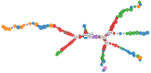

<br>
# MGPfact.jl 
Single-cell differentiation trajectory reconstruction

## installation
```julia
]
add https://github.com/renjun0324/MGPfact.jl
using MGPfact
```

## quick start

```julia

# load test data
nc = 1
using RData
L = 3
Q = 3
rt = 1
test_data = joinpath(dirname(pathof(MGPfact)),"..","test","test.rda")
yx = RData.load(test_data)
yx = yx["murp_matrix_pca"][:,1:Q]
iterations = 200

# import packages
using MGPfact, Mamba

# running model
model = MGPfact.modMGPpseudoT()
SC,inits,scheme = MGPfact.Initialize(yx, Q, L, rt, iterations, nc)

setinputs!(model, SC)
setinits!(model, inits)
setsamplers!(model, scheme)

@time sim1 = mcmc(model, SC, inits, iterations, burnin = 0, chains = nc)

# save
using JLD2
write(string("iter",sim.model.iter,"_bi",sim.model.burnin,".jls"), sim)
@save string("inits.jld2") inits


```

## multiple chains

```julia

# load test data
using RData
nc = 3
L = 3
Q = 3
rt = 1

test_data = joinpath(dirname(pathof(MGPfact)),"..","test","test.rda")
yx = RData.load(test_data)
yx = yx["murp_matrix_pca"][:,1:Q]
iterations = 200

# import packages
using Distributed
addprocs(nc)
@everywhere using MGPfact, Mamba

# running model
model = MGPfact.modMGPpseudoT()
SC,inits,scheme = MGPfact.Initialize(yx, Q, L, rt, iterations, nc)

setinputs!(model, SC)
setinits!(model, inits)
setsamplers!(model, scheme)

@time sim1 = mcmc(model, SC, inits, iterations, burnin = 0, chains = nc)

# save
using JLD2
write(string("iter",sim.model.iter,"_bi",sim.model.burnin,".jls"), sim)
@save string("inits.jld2") inits

```
